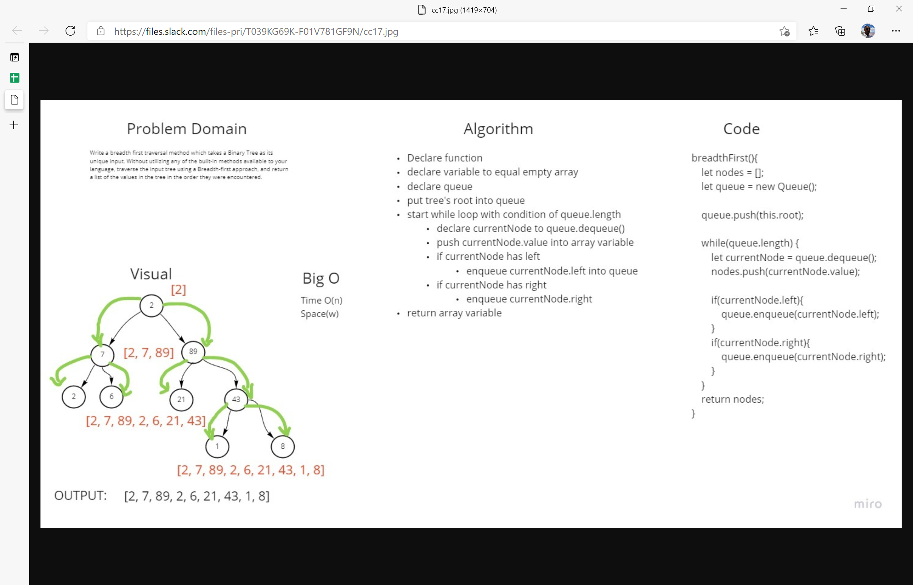

### code -challenge 16
### Find the Maximum Value in a Binary Tree
 ### challenge 
 

 - create a method function that will find the maximum value on any given tree
.
 ### approach and Efficiency 

 - I just used the traverse method coupled with a comparator function to find the maximum value.

 ### API
 - tree maximum value function utilizes pre-order traversal and returns maximum value

  
  ### type of method 
 

  ## Solution
<!-- Embedded whiteboard image -->

### code -challenge 17

### Breadth-first Traversal.

- create a breadth first traversal method for the tree class .

 ### approach and Efficiency 

 - I just used a queue to traverse the tree by level in a breadth first approach.
 ### API
 - Tree breadth-first traversal utilizes a queue to traverse the tree by breadth level.
  

