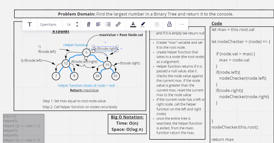

### Find the Maximum Value in a Binary Tree
 ### challenge 
 

 - create a method function that will find the maximum value on any given tree
.
 ### approach and Efficiency 

 - I just used the traverse method coupled with a comparator function to find the maximum value.

 ### API
 - tree maximum value function utilizes pre-order traversal and returns maximum value

  
  ### type of method 
  - preorder
  - postorder
  - inorder 

  ## Solution
<!-- Embedded whiteboard image -->

