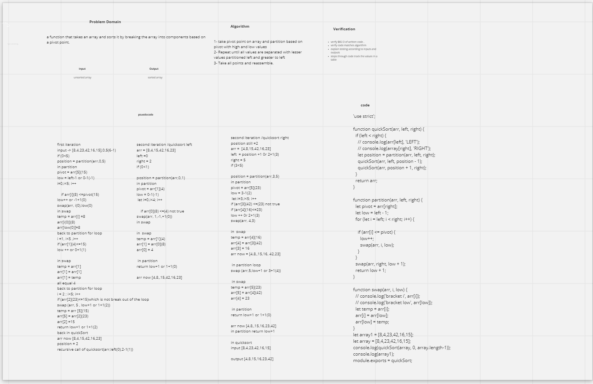

### Code Challenge: Class 28

 - create a ffunction that will sort an array by utilizing a pivot point within an array and halve the array at the point proceeding to sort each half recursively.

- Quick sort is a highly efficient sorting algorithm and is based on partitioning of array of data into smaller arrays. A large array is partitioned into two arrays one of which holds values smaller than the specified value, say pivot, based on which the partition is made and another array holds values greater than the pivot value.

- Quicksort partitions an array and then calls itself recursively twice to sort the two resulting subarrays. This algorithm is quite efficient for large-sized data sets as its average and worst-case complexity are O(n2), respectively.

- The pivot value divides the list into two parts. And recursively, we find the pivot for each sub-lists until all lists contains only one element.

 ### Approach & Efficiency 
  - The approch I used to solve this function . I utilized the pseudo code to create a visual walkthrough and then I wrote a code . 

  Solution !

  

  - source :https://www.tutorialspoint.com/data_structures_algorithms/quick_sort_algorithm.htm
