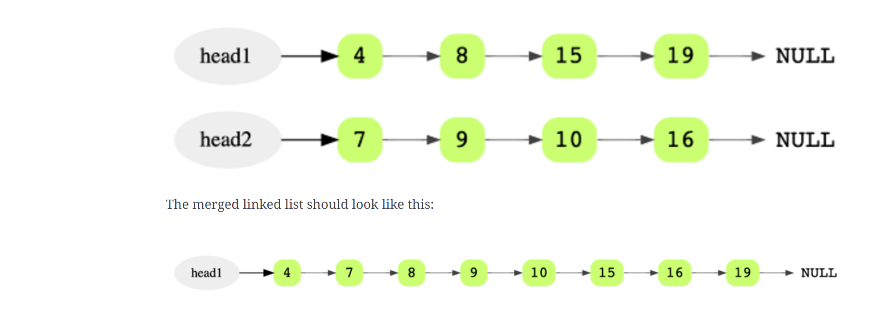
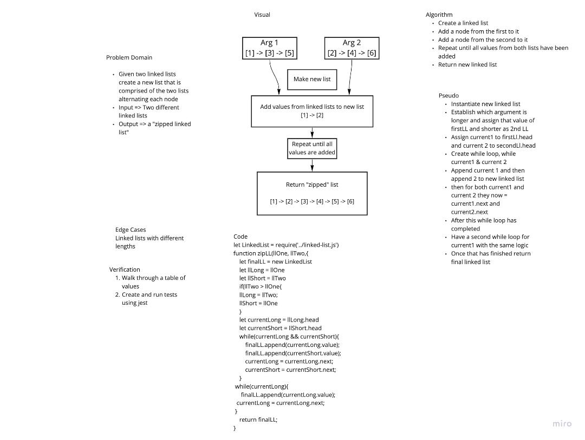
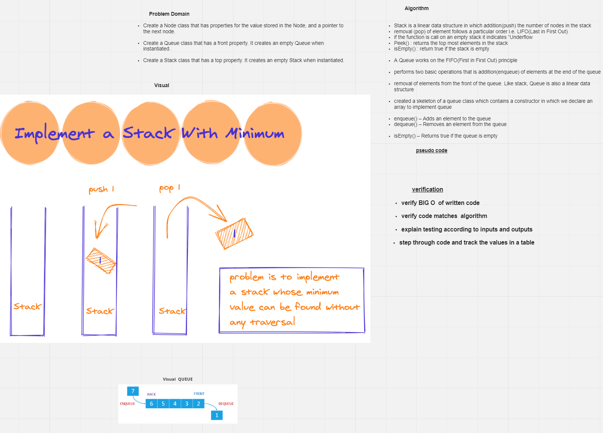
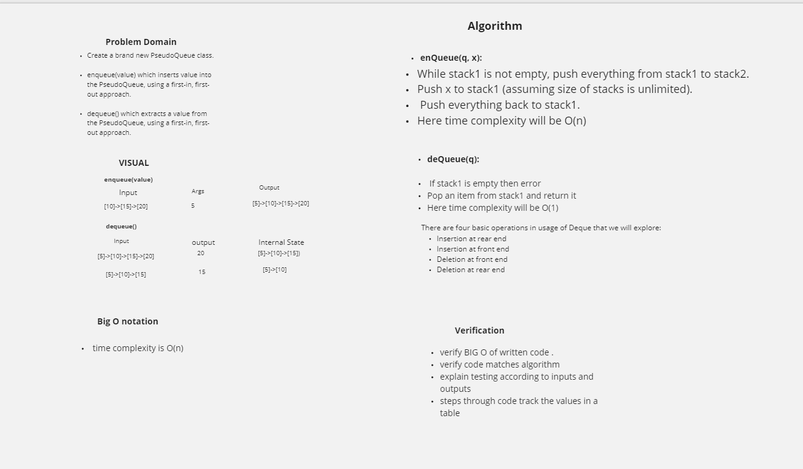

# Code Challenge: Class 01

# Reverse an Array

Write a function that reverses an array, in place

Be careful of: empty arrays, arrays with only 1, odd numbered count, even numbered count
<!-- Short summary or background information -->

## Challenge
<!-- Description of the challenge -->

## Approach & Efficiency
<!-- What approach did you take? Why? What is the Big O space/time for this approach? -->

- Identify the start and end of the array (0 and length -1)
- Swap the arr[start] with arr[end]
- Move Start forward by 1
- Move End backwards by 1
- Repeat while start <= end

## Solution
<!-- Embedded whiteboard image -->

# Code Challenge: Class 02

#  Array-shift

# Challenge Summary
<!-- Short summary or background information -->
The array-shift  removes the first element from an array and returns that removed element and This method changes the length of the array

## Challenge Description
<!-- Description of the challenge -->
Write a function called insertShiftArray which takes in an array and the value to be added. Without utilizing any of the built-in methods available to your language, return an array with the new value added at the middle index.
.
## Approach & Efficiency
<!-- What approach did you take? Why? What is the Big O space/time for this approach? -->
create a function that takes an array and a value as input and then find the middle point of the index by using for loop and ceil.Maths to round up the middle number to integer .

## Solution
<!-- Embedded whiteboard image -->

# Code Challenge: Class 03

# array-binary-search
 #### Feature Tasks
- Write a function called BinarySearch which takes in 2 parameters: a sorted array and the search key. Without utilizing any of the built-in methods available to your language, return the index of the array’s element that is equal to the search key, or -1 if the element does not exist.
- NOTE: The search algorithm used in your function should be a binary search.

# Challenge Summary
<!-- Short summary or background information -->

## Approach & Efficiency
- Begin with an interval covering the whole array.
- Create a left pointer at the start of the array and a right pointer at the end of the array.
- Loop over and over the array.
- If the value of the search key is less than the item in the middle of the interval, narrow the interval to the lower half.
- Otherwise narrow it to the upper half.
- Repeatedly check until the value is found or the interval is empty.

## Solution
<!-- Embedded whiteboard image -->

# Code Challenge: Class 05

# Implementation: Singly Linked Lists

# Singly Linked List

- A singly linked list is a type of linked list that is unidirectional, that is, it can be traversed in only one direction from head to the last node (tail). Each element in a linked list is called a node. A single node contains data and a pointer to the next node which helps in maintaining the structure of the list.

## Challenge
- Create a Node class that has properties for the value stored in the Node, and a pointer to the next Node. 
- on this  single linkedList class define a method called **insert** ,  define a method called  **includes** , define a method called **toString** .

## Approach & Efficiency

- LinkedList -> Insertion in the beginning : O(1)
- LinkedList -> Retrieval based on index : O(i) where i is number of elements 
- LinkedList is that insertions and deletion can be done very quickly
- If you just want to insert an element right to the beginning of the LinkedList, that can be done in constant time O(1).
# big O Notation 
- provide transparency into(with out acctually running).
-time commplexity (efficiency)
- space complexity (strong ).

## API
 ### insert 
- new node is added before the current head node. To fulfill this operation we will first create a node. The newly created node will be having two properties as defined in the constructor function of the Node class, value  and next.
### includes 
- find for the value in single linkedlist and return boolean(true or falsy).
### tostring 
-  the out put of the linked list it should be in a string .
### append 
- add node at the end of the linked list .

  ## Code Challenge: Class 06
=======
## Code Challenge: Class 06

## Feature Tasks
- Write the following methods for the Linked List class:

- append(value) which adds a new node with the given value to the end of the list
- insertBefore(value, newVal) which add a new node with the given newValue immediately before the first value node
- insertAfter(value, newVal) which add a new node with the given newValue immediately after the first value node

###
 append(value)

input ====>  head -> [1] -> [3] -> [2] -> X  
     =====> args 5
output====>  head -> [1] -> [3] -> [2] -> [5] -> X

## insertBefore(value, newVal)
Input=======> head -> [1] -> [3] -> [2] -> X
args =======> 3, 5  this means add a new value 5 before node 3 
Output=======>head -> [1] -> [5] -> [3] -> [2] -> X

input =======> head -> [1] -> [3] -> [2] -> X
args ========> 1, 5 this means add the new value 5 before node 1 
output ======> head -> [5] -> [1] -> [3] -> [2] -> X

### insertAfter(value, newVal)
Input=======> head -> [1] -> [3] -> [2] -> X
args =======> 3, 5  this means add a new value 5 after  node 3 
Output=======>head -> [1] -> [3] -> [5] -> [2] -> X

input =======> head -> [1] -> [3] -> [2] -> X
args ========> 1, 5 this means add the new value 5 after  node 1 
output ======> head -> [1] -> [5] -> [3] -> [2] -> X

## Code Challenge: Class 07

# Feature Tasks

- Write a method for the Linked List class which takes a number, k, as a parameter. Return the node’s value that is k from the end of the linked list. You have access to the Node class and all the properties on the Linked List class as well as the methods created in previous challenge

### ll.kthFromEnd(k)

Input ll	Arg k	Output                    Arg k      Output 
- head -> [1] -> [3] -> [8] -> [2] -> X	   0	=======> 2
- head -> [1] -> [3] -> [8] -> [2] -> X	   2	=======> 3
- head -> [1] -> [3] -> [8] -> [2] -> X	   6	=======> Exception

## Code Challenge: Class 08

## Zip two linked lists.

- Write a function called zipLists which takes two linked lists as arguments. Zip the two linked lists together into one so that the nodes alternate between the two lists and return a reference to the head of the zipped list. Try and keep additional space down to O(1). You have access to the Node class and all the properties on the Linked List class as well as the methods created in previous challenges.

 ## Approach & Efficiency

- Given two sorted linked lists, merge them so that the resulting linked list is also sorted.

- Use two iterators to scan both lists

Consider two sorted linked lists as an example.

### Solution Breakdown
Maintain a head and a tail pointer on the merged linked list. Then choose the head of the merged linked list by comparing the first node of both linked lists. For all subsequent nodes in both lists, you choose the smaller current node and link it to the tail of the merged list, and moving the current pointer of that list one step forward.

You keep doing this while there are some remaining elements in both the lists. If there are still some elements in only one of the lists, you link this remaining list to the tail of the merged list.

Initially, the merged linked list is NULL.

Compare the value of the first two nodes and make the node with the smaller value the head node of the merged linked list. In this example, it is 4 from head1.

Since it’s the first and only node in the merged list, it will also be the tail.

Then move head1 one step forward.
<!-- Embedded whiteboard image -->

### whiteboard 

# Class 10: Stack and a Queue Implementation

## test  npm test stacksAndQueues

# challenge 
 
- To create a Node class that has properties for the value stored in the Node, and a pointer to the next node.
- To create a **Stack** class that has a **top** property. It creates an empty Stack when instantiated.

  - **push** which takes any value as an argument and add a new node with that value to the top of the stack with an O(1) Time performance . 

  - **POP** That does not take any argument, removes the node from the top of the stack, and returns the node’s value.

  - **peek**  that does not take an argument and returns the value of the node located on top of the stack, without removing it from the stack.

  - **isEmpty** that takes no argument, and returns a boolean indicating whether or not the stack is empty.

- Create a **Queue** class that has a **front** property. It creates an empty Queue when instantiated.
     
- This object should be aware of a default empty value assigned to front when the queue is created.

   - **enqueue** which takes any value as an argument and adds a new node with that value to the back of the queue with an O(1) Time performance.

   - **dequeue** That does not take any argument, removes the node from the front of the queue, and returns the node’s value.

   - **peek** That does not take an argument and returns the value of the node located in the front of the queue, without removing it from the queue.

   - **isEmpty** that takes no argument, and returns a boolean indicating whether or not the queue is empty

   ## Approach & Efficiency 

- Array implementations of stacks. Representing stacks with arrays . In particular, we maintain an instance variable n that stores the number of items in the stack and an array items[] that stores the n items, with the most recently inserted item in items[n-1] and the least recently inserted item in items[0]. This policy allows us to add and remove items at the end without moving any of the other items in the stack.

## code 
     class Stack {
     items = []
     push = (element) => this.items.push(element)
     pop = () => this.items.pop()
     isempty = () => this.items.length === 0
     empty = () => (this.items.length = 0)
     size = () => this.items.length
    }

  

  # Class 11: Implement a Queue using two Stacks.

  # challenge 

  - to create a brand new PseudoQueue class. Do note use ab existing Queue. instead, this PseudoQueue class will implement our standard queue interface(the two methods listed below),rnsure that your class with the following methods 
   

 - enqueue(value) which inserts value into the PseudoQueue, using a first-in, first-out approch (FIFO)

  - enQueue(q, x):

- While stack1 is not empty, push everything from stack1 to stack2.
- Push x to stack1 (assuming size of stacks is unlimited).
- Push everything back to stack1.
- Here time complexity will be O(n)

-  dequeue (value) which extracts a valu from the PseudoQueue, using a first-in , first-out approch 
- deQueue(q):

- If stack1 is empty then error
- Pop an item from stack1 and return it
- Here time complexity will be O(1)

#### approch and Efficiency 
- enqueue space O(1) time O(1)
- dequeue space : space O(n^2)- time :O(n^2)

### collaborated with :

Dawit Ayana

 