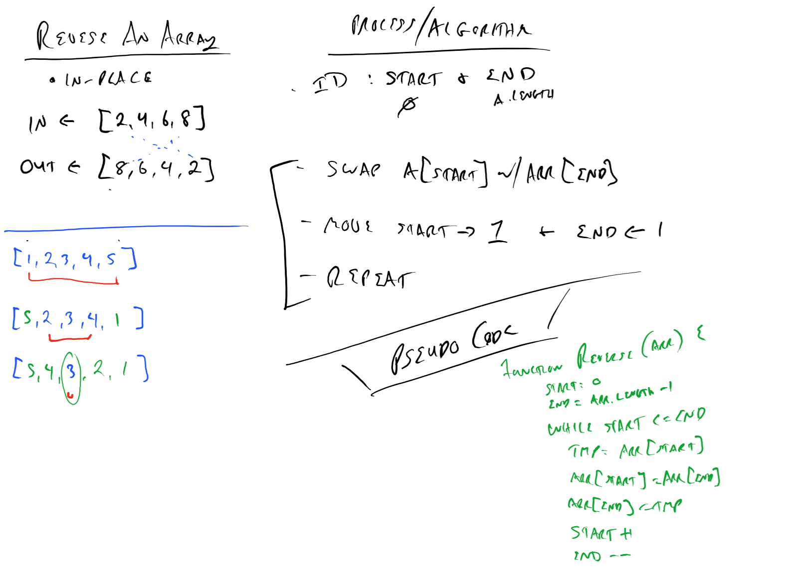
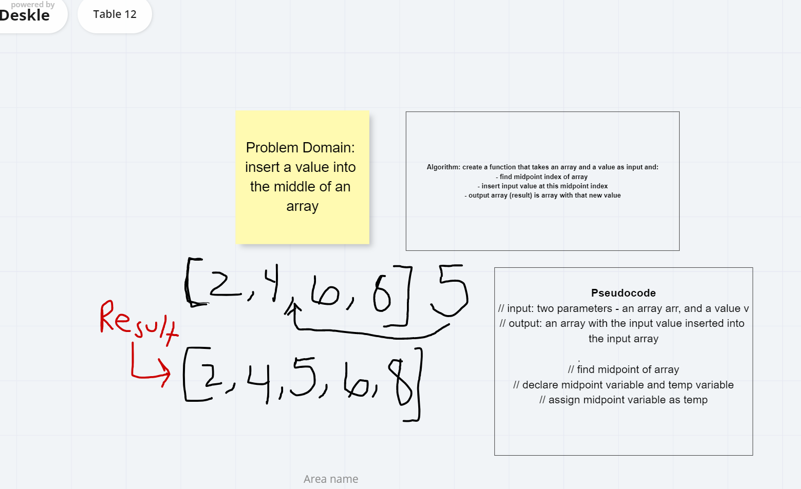

# Code Challenge: Class 01

# Reverse an Array

Write a function that reverses an array, in place

Be careful of: empty arrays, arrays with only 1, odd numbered count, even numbered count
<!-- Short summary or background information -->

## Challenge
<!-- Description of the challenge -->

## Approach & Efficiency
<!-- What approach did you take? Why? What is the Big O space/time for this approach? -->

- Identify the start and end of the array (0 and length -1)
- Swap the arr[start] with arr[end]
- Move Start forward by 1
- Move End backwards by 1
- Repeat while start <= end

## Solution
<!-- Embedded whiteboard image -->

# Code Challenge: Class 02

#  Array-shift

# Challenge Summary
<!-- Short summary or background information -->
The array-shift  removes the first element from an array and returns that removed element and This method changes the length of the array

## Challenge Description
<!-- Description of the challenge -->
Write a function called insertShiftArray which takes in an array and the value to be added. Without utilizing any of the built-in methods available to your language, return an array with the new value added at the middle index.
.
## Approach & Efficiency
<!-- What approach did you take? Why? What is the Big O space/time for this approach? -->
create a function that takes an array and a value as input and then find the middle point of the index by using for loop and ceil.Maths to round up the middle number to integer .

## Solution
<!-- Embedded whiteboard image -->

# Code Challenge: Class 03

# array-binary-search
 #### Feature Tasks
- Write a function called BinarySearch which takes in 2 parameters: a sorted array and the search key. Without utilizing any of the built-in methods available to your language, return the index of the array’s element that is equal to the search key, or -1 if the element does not exist.
- NOTE: The search algorithm used in your function should be a binary search.

# Challenge Summary
<!-- Short summary or background information -->

## Approach & Efficiency
- Begin with an interval covering the whole array.
- Create a left pointer at the start of the array and a right pointer at the end of the array.
- Loop over and over the array.
- If the value of the search key is less than the item in the middle of the interval, narrow the interval to the lower half.
- Otherwise narrow it to the upper half.
- Repeatedly check until the value is found or the interval is empty.

## Solution
<!-- Embedded whiteboard image -->

# Code Challenge: Class 05

# Implementation: Singly Linked Lists

# Singly Linked List

- A singly linked list is a type of linked list that is unidirectional, that is, it can be traversed in only one direction from head to the last node (tail). Each element in a linked list is called a node. A single node contains data and a pointer to the next node which helps in maintaining the structure of the list.

## Challenge
- Create a Node class that has properties for the value stored in the Node, and a pointer to the next Node. 
- on this  single linkedList class define a method called **insert** ,  define a method called  **includes** , define a method called **toString** .

## Approach & Efficiency

- LinkedList -> Insertion in the beginning : O(1)
- LinkedList -> Retrieval based on index : O(i) where i is number of elements 
- LinkedList is that insertions and deletion can be done very quickly
- If you just want to insert an element right to the beginning of the LinkedList, that can be done in constant time O(1).
# big O Notation 
- provide transparency into(with out acctually running).
-time commplexity (efficiency)
- space complexity (strong ).

## API
 ### insert 
- new node is added before the current head node. To fulfill this operation we will first create a node. The newly created node will be having two properties as defined in the constructor function of the Node class, value  and next.
### includes 
- find for the value in single linkedlist and return boolean(true or falsy).
### tostring 
-  the out put of the linked list it should be in a string .
### append 
- add node at the end of the linked list .
