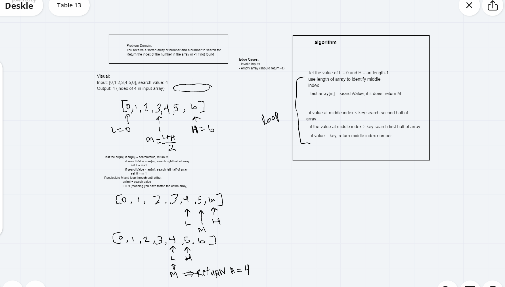

# Code Challenge: Class 03

# array-binary-search
 #### Feature Tasks
- Write a function called BinarySearch which takes in 2 parameters: a sorted array and the search key. Without utilizing any of the built-in methods available to your language, return the index of the array’s element that is equal to the search key, or -1 if the element does not exist.
- NOTE: The search algorithm used in your function should be a binary search.

# Challenge Summary
<!-- Short summary or background information -->

## Approach & Efficiency
- Begin with an interval covering the whole array.
- Create a left pointer at the start of the array and a right pointer at the end of the array.
- Loop over and over the array.
- If the value of the search key is less than the item in the middle of the interval, narrow the interval to the lower half.
- Otherwise narrow it to the upper half.
- Repeatedly check until the value is found or the interval is empty.

## Solution
<!-- Embedded whiteboard image -->

