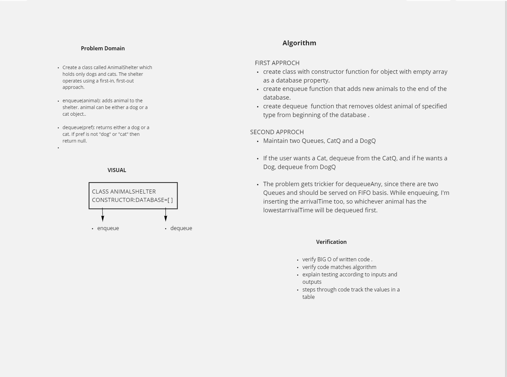

### fifo Animal Shelter

#### Code Challenge: Class 12

- To create an animalshealter class which holds only cats and dogs .
- enqueue(animal)which adds an animal to the shelter.
   - it can be a dog or a cat object .
- dequeue(pref) returns a dog or a cat .
    - if pref is not a dog or cat then return null .
#### Approach & Efficiency
- To solve this code-challenge we have to create two queues in our function to handle the two different choices of animals.

- Create the data structures to maintain this system and implement operations such as enqueue, dequeueAny, dequeueDog and dequeueCat.

### collaborated with :
   Dawit Ayana

## Solution
<!-- Embedded whiteboard image -->
