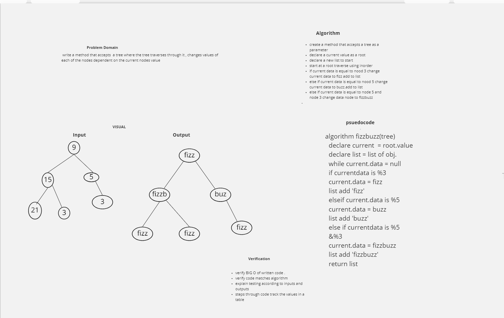

### code -challenge 18

### Conduct “FizzBuzz” on a k-ary tree while traversing through it to create a new tree.
 ### challenge 

  
<!-- Short summary or background information -->

## Challenge
Create a function that intakes a k-ary tree and changes values of nodes to Fizz, Buzz, FizzBuzz or a string of the value depending on if the value is divisible by 3, 5, or 3 and 5 respectively. Return a new tree.

## Approach & Efficiency
 creating functions with O(1) and O(n) Big O space/time.

## Solution
To solve this problem the best approch is used a breadth first traversel method that utilizes a queue to move through the k-ary tree. At each value take a series of comparator functions with modulus to analyze whether or not the values where divisible by 3, 5, or 3 & 5, then changed the current value to fizz, buzz and fizzbuzz. 
<!-- Embedded whiteboard image -->

