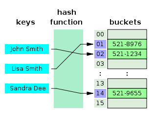

## Code Challenge: Class 30
## Hash Table Implementation

- A hash table is a type of data structure that stores key-value pairs. The key is sent to a hash function that performs arithmetic operations on it. The result (commonly called the hash value or hash) is the index of the key-value pair in the hash table. 

### Components of a hash table

#### A basic hash table consists of two parts:

- 1. Hash function
      - the hash function determines the index of our key-value pair. 
- 2. Array
      - The array holds all the key-value entries in the table. The size of the array should be set according to the amount of data expected.
       

   ### Collisions in hash tables & resolutions

   - A collision occurs when two keys get mapped to the same index. There are several ways of handling collisions.

        - 1. Linear probing

            - If a pair is hashed to a slot which is already occupied, it searches linearly for the next free slot in the table.
        - 2. Chaining

             - The hash table will be an array of linked lists. All keys mapping to the same index will be stored as linked list nodes at that index.
        - 3. Resizing the hash table
             - The size of the hash table can be increased in order to spread the hash entries further apart. A threshold value signifies the percentage of the hash table that needs to be occupied before resizing. A hash table with a threshold of 0.6 would resize when 60% of the space is occupied. As a convention, the size of the hashtable is doubled. This can be memory intensive.

