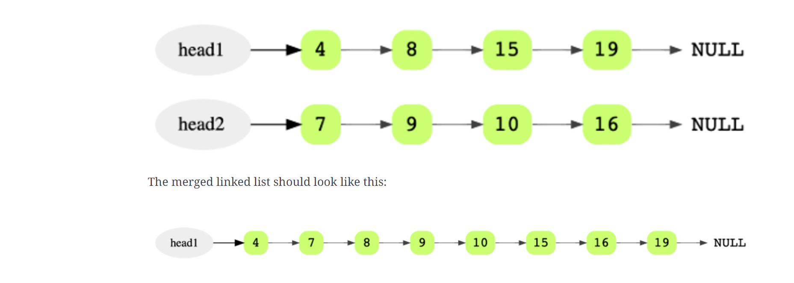

## Code Challenge: Class 08

## Zip two linked lists.

- Write a function called zipLists which takes two linked lists as arguments. Zip the two linked lists together into one so that the nodes alternate between the two lists and return a reference to the head of the zipped list. Try and keep additional space down to O(1). You have access to the Node class and all the properties on the Linked List class as well as the methods created in previous challenges.

 ## Approach & Efficiency

- Given two sorted linked lists, merge them so that the resulting linked list is also sorted.

- Use two iterators to scan both lists

Consider two sorted linked lists as an example.

### Solution Breakdown
Maintain a head and a tail pointer on the merged linked list. Then choose the head of the merged linked list by comparing the first node of both linked lists. For all subsequent nodes in both lists, you choose the smaller current node and link it to the tail of the merged list, and moving the current pointer of that list one step forward.

You keep doing this while there are some remaining elements in both the lists. If there are still some elements in only one of the lists, you link this remaining list to the tail of the merged list.

Initially, the merged linked list is NULL.

Compare the value of the first two nodes and make the node with the smaller value the head node of the merged linked list. In this example, it is 4 from head1.

Since it’s the first and only node in the merged list, it will also be the tail.

Then move head1 one step forward.
<!-- Embedded whiteboard image -->

### whiteboard 

