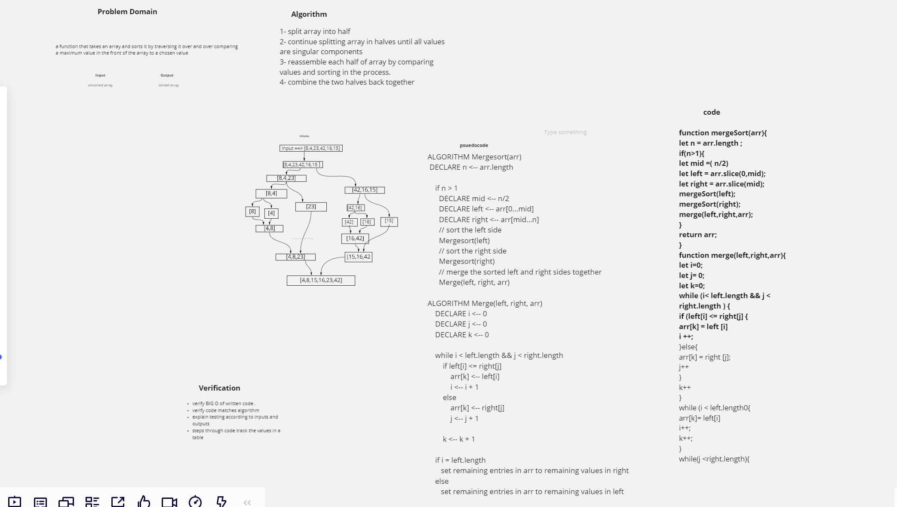

- Below is a visual walkthrough of using an merge sort function to properly sort a provided array. This function utilizes a breaking down and than comparison of individual components approach before re-assembling the array

- FROM the above whiteboard image , illustrate the deconstaction of the individual components .

- then compare half of the components either left or right .
