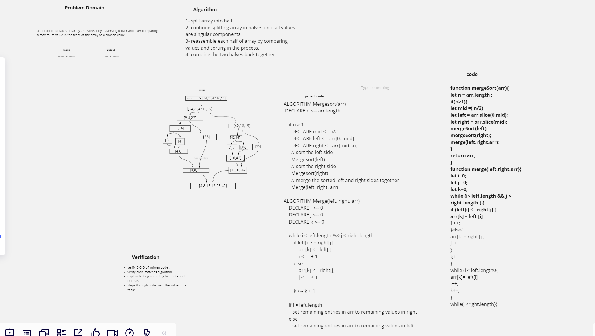

 ### Code Challenge: Class 27

 ### Merge Sort
- create a function that will split an array at halfway points  and then compare each components and then sort and finaly re-assembling .

- Document your explanation by creating a blog article that shows the step-by-step output after each iteration through some sort of visual.

- Once you are done with your article, code a working, tested implementation of Merge Sort based on the pseudocode provided.

 ## solution 

 