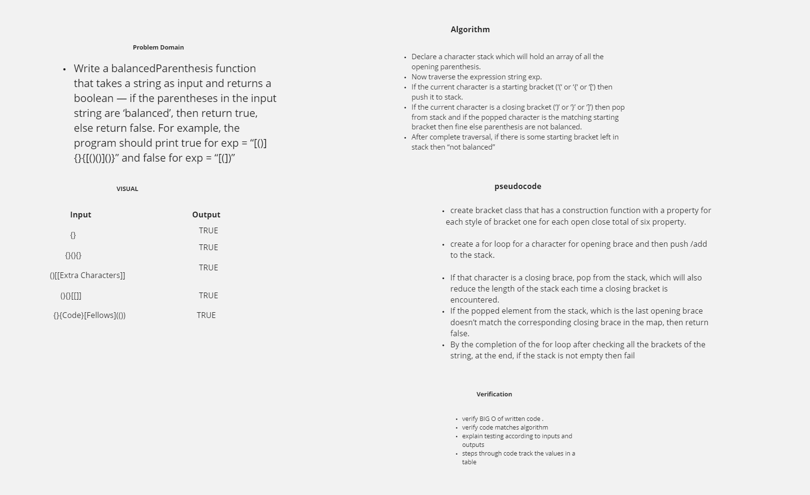

### Code Challenge 
## Multi-bracket Validation.

### Challenge Description

- Create a function that takes a string and returns true if all types of brackets have their respective closing brackets with in the string .

- A classic problem — Check for balanced parentheses in an expression. Two brackets are considered to be a matched pair if the an opening bracket (i.e., (, [, or { ) occurs to the left of a closing bracket (i.e., ), ], or }) of the exact same type. There are three types of matched pairs of brackets: [], {}, and ().

## Approach & Efficiency.

- Write a balancedParenthesis function that takes a string as input and returns a boolean — if the parentheses in the input string are ‘balanced’, then return true, else return false. For example, the program should print true for exp = “[()]{}{[()()]()}” and false for exp = “[(])”

## Solution
<!-- Embedded whiteboard image -->

