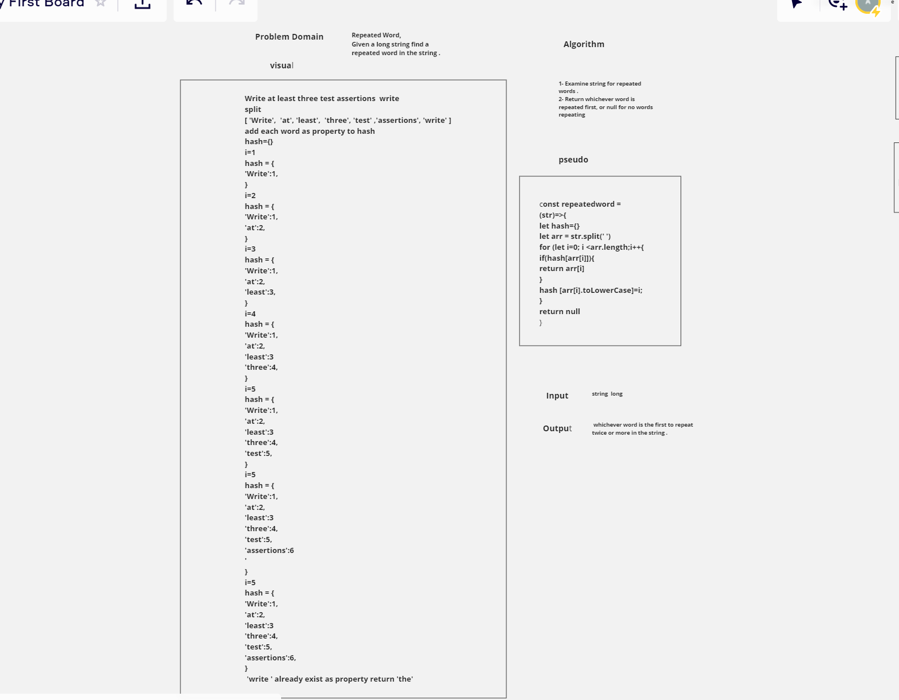

### Repeated Word
### code challenge 31

### challenge
   - create a function called repeatedwordthat should return a word that is repeated within lengthy string.

   - Write a function that accepts a lengthy string parameter.

   - Without utilizing any of the built-in library methods available to your language, return the first word to occur more than once in that provided string.

### Approach
   - Write a function that accepts a lengthy string parameter.
   - have an empty array

   - then split the sentence into indivisual words

   - initiate a hash map to use key value pairs

### solution 
   