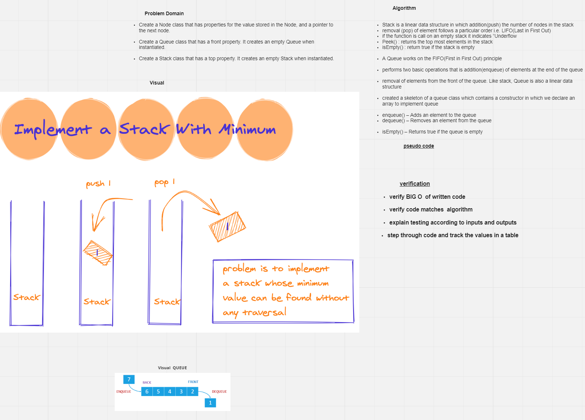

# Class 10: Stack and a Queue Implementation

## test  npm test stacksAndQueues

# challenge 
 
- To create a Node class that has properties for the value stored in the Node, and a pointer to the next node.
- To create a **Stack** class that has a **top** property. It creates an empty Stack when instantiated.

  - **push** which takes any value as an argument and add a new node with that value to the top of the stack with an O(1) Time performance . 

  - **POP** That does not take any argument, removes the node from the top of the stack, and returns the node’s value.

  - **peek**  that does not take an argument and returns the value of the node located on top of the stack, without removing it from the stack.

  - **isEmpty** that takes no argument, and returns a boolean indicating whether or not the stack is empty.

- Create a **Queue** class that has a **front** property. It creates an empty Queue when instantiated.
     
- This object should be aware of a default empty value assigned to front when the queue is created.

   - **enqueue** which takes any value as an argument and adds a new node with that value to the back of the queue with an O(1) Time performance.

   - **dequeue** That does not take any argument, removes the node from the front of the queue, and returns the node’s value.

   - **peek** That does not take an argument and returns the value of the node located in the front of the queue, without removing it from the queue.

   - **isEmpty** that takes no argument, and returns a boolean indicating whether or not the queue is empty

   ## Approach & Efficiency 

- Array implementations of stacks. Representing stacks with arrays . In particular, we maintain an instance variable n that stores the number of items in the stack and an array items[] that stores the n items, with the most recently inserted item in items[n-1] and the least recently inserted item in items[0]. This policy allows us to add and remove items at the end without moving any of the other items in the stack.

## code 
     class Stack {
     items = []
     push = (element) => this.items.push(element)
     pop = () => this.items.pop()
     isempty = () => this.items.length === 0
     empty = () => (this.items.length = 0)
     size = () => this.items.length
    }

  