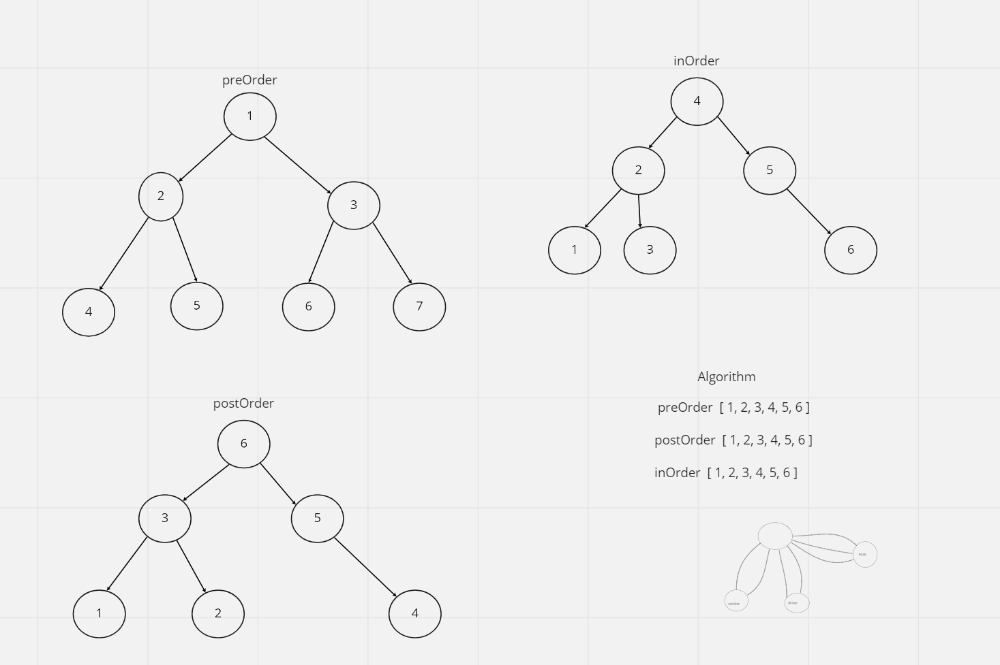
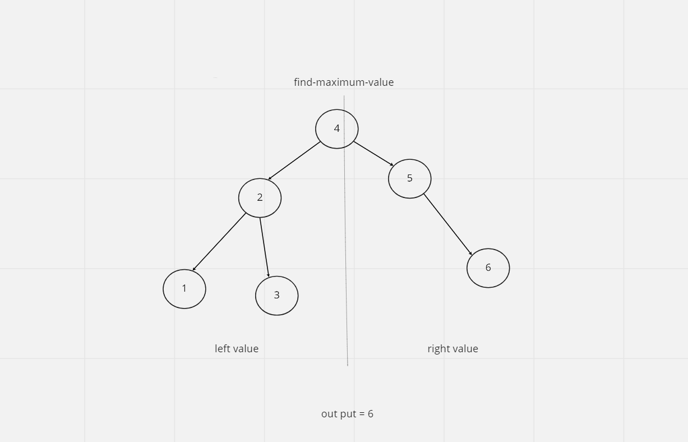

### trees
 ### challenge 
 

 - create a class for binary tree with constructor function and traversal methods.
 - creat a class for binary search tree with a constructir function and add and cotains method.

 ### approach and Efficiency 

 - I used recursive function to traverse the tree and search the binary search tree .

 ### API
 - tree pre-order traversal utilizes root-left-right order 
 - tree in-order utilizes left-root-right order .
 - tree post-order utilizes left-right-root order 
  - BST add method users recursive function to compare left and right values and add a new node at appropriate place.
  
  ### type of method 
  - preorder
  - postorder
  - inorder 

  ## Solution
<!-- Embedded whiteboard image -->

